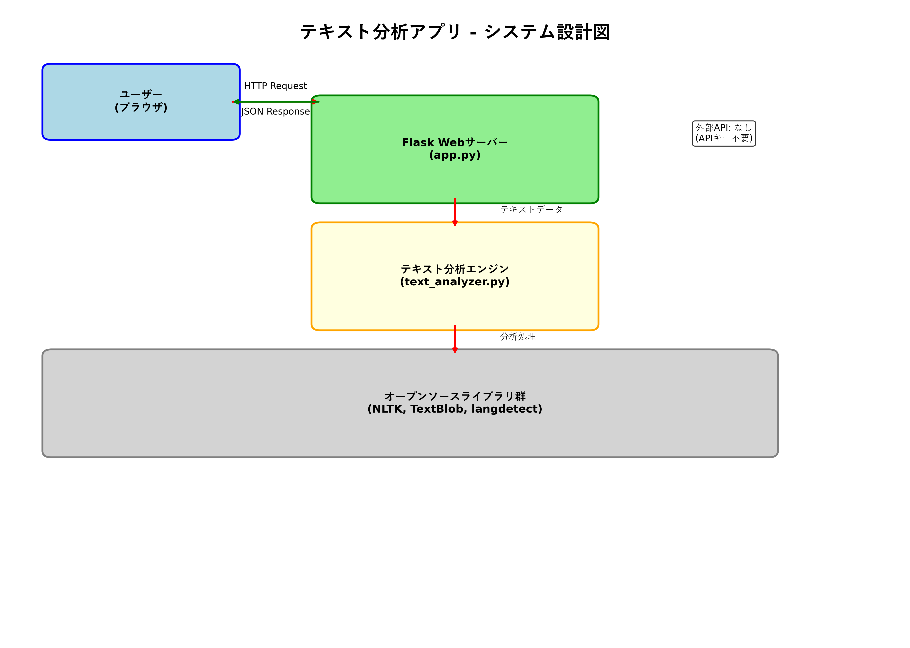
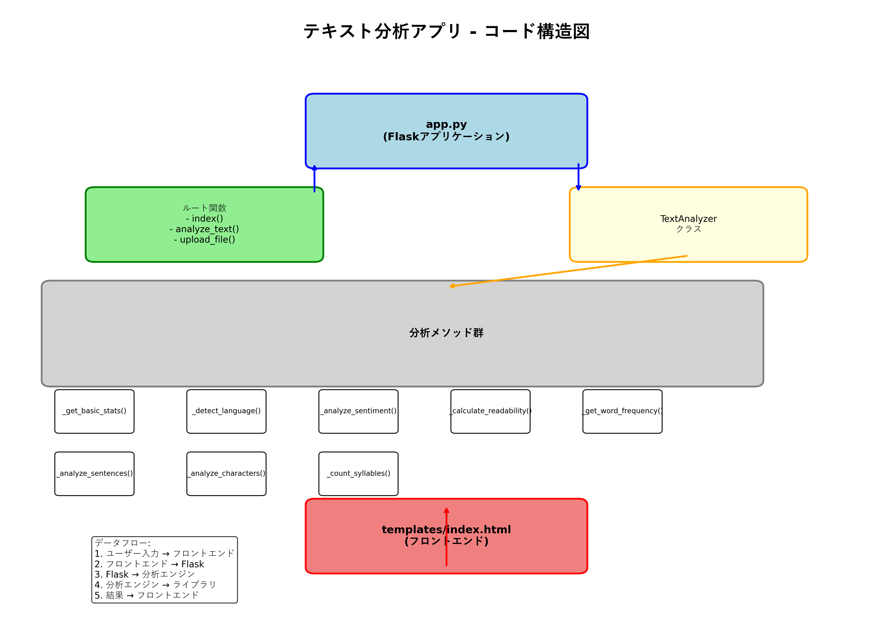

# テキスト分析アプリ

## 概要

このアプリケーションは、ユーザーが入力したテキストまたはアップロードしたテキストファイルを分析し、包括的な分析結果を提供するWebアプリケーションです。APIキーやトークンを必要としないオープンソースライブラリを使用して、テキストの詳細な分析を行います。

## 主な機能

- **基本統計**: 文字数、単語数、文の数、段落数などの基本情報
- **言語検出**: テキストの言語を自動検出
- **感情分析**: テキストの感情（ポジティブ/ネガティブ/中性）と主観性を分析
- **可読性分析**: Flesch可読性スコアによる文章の読みやすさ評価
- **単語頻度分析**: 最も頻繁に使用される単語の特定
- **文の分析**: 文の長さ分布と統計情報
- **文字分析**: 文字の使用頻度と統計情報

## 使用技術

- **フレームワーク**: Streamlit
- **テキスト分析**: 
  - NLTK (Natural Language Toolkit)
  - TextBlob (感情分析)
  - langdetect (言語検出)
- **データ可視化**: Plotly
- **データ処理**: Pandas

## 使用API

このアプリケーションは**APIキーやトークンを必要としない**オープンソースライブラリのみを使用しています：

- **NLTK**: 自然言語処理（トークン化、ストップワード）
- **TextBlob**: 感情分析
- **langdetect**: 言語検出

## インストール方法

1. リポジトリをクローン
```bash
git clone <repository-url>
cd text-analysis-app
```

2. 依存関係をインストール
```bash
pip install -r requirements.txt
```

3. アプリケーションを起動
```bash
streamlit run app.py
```

## 使用方法

1. アプリケーションを起動すると、ブラウザで自動的に開きます
2. サイドバーで入力方法を選択：
   - **テキスト入力**: テキストエリアに直接入力
   - **ファイルアップロード**: テキストファイル（.txt）をアップロード
3. 「分析開始」または「ファイル分析」ボタンをクリック
4. 分析結果がタブ形式で表示されます：
   - 📊 基本統計
   - 🌍 言語検出
   - 💝 感情分析
   - 📖 可読性
   - 📈 単語頻度
   - 📝 文の分析
   - 🔤 文字分析

## プロジェクト構造

```
text-analysis-app/
├── app.py                 # Streamlitメインアプリケーション
├── text_analyzer.py       # テキスト分析ロジック
├── requirements.txt       # Python依存関係
├── README.md             # プロジェクト説明
├── .gitignore           # Git除外設定
└── docs/                # ドキュメント
    ├── system_design.png    # システム設計図
    └── code_structure.png   # コード構造図
```

## システム設計図



## コード構造図



## 開発者向け情報

### アーキテクチャ

- **フロントエンド**: Streamlit（PythonベースのWebフレームワーク）
- **バックエンド**: Python（テキスト分析ロジック）
- **データ可視化**: Plotly（インタラクティブなグラフ）

### 拡張可能な機能

- 新しい分析機能の追加
- より多くの言語対応
- エクスポート機能（PDF、CSV）
- リアルタイム分析
- バッチ処理機能

## ライセンス

このプロジェクトはMITライセンスの下で公開されています。
